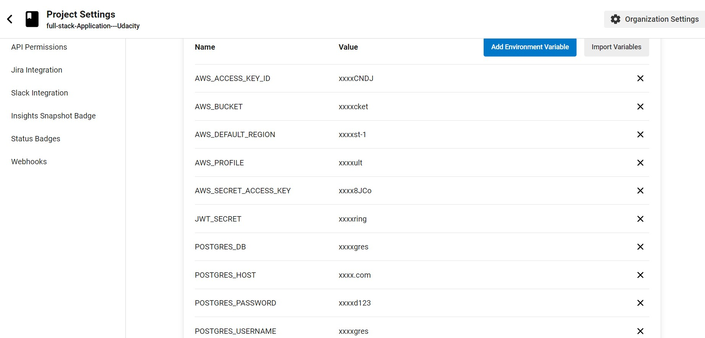

# Pipeline Process

## 🚩 Table of Contents

- [Introduction](#introduction)
- [Understanding the config.yml file](#understanding-the-configyml-file)
- [Pipeline process overview](#pipeline-process-overview)
- [Build stage](#build-stage)
  - [Tools and technologies used](#tools-and-technologies-used)
    - [Steps involved](#steps-involved)
  - [Deploy Stage](#deploy-stage)
    - [Steps involved](#steps-involved-1)
- [Continuous Integration Platform](#continuous-integration-platform)
  - [Overview of CI platforms](#overview-of-ci-platforms)
  - [Commonly used CI platforms](#commonly-used-ci-platforms)
  - [CircleCI platform](#circleci-platform)
    - [How to use CircleCI?](#how-to-use-circleci)
    - [Screenshots of the process](#screenshots-of-the-process)

## Introduction

- The pipeline process is a crucial aspect of any software development project, as it provides a streamlined and automated approach to building, testing, and deploying code changes. The pipeline process is essentially a set of steps and actions that are taken in order to ensure that code changes are thoroughly tested, reviewed, and integrated into the main codebase in a controlled and consistent manner.

- The pipeline process helps to ensure that code changes are deployed in a reliable and predictable manner, with minimal risk of introducing bugs or other issues into the production environment. This is achieved through a series of automated tests, checks, and approvals that are carried out at various stages of the pipeline process.

- The pipeline process typically consists of several stages, including building, testing, deploying, and monitoring. Each stage is designed to ensure that the code changes are thoroughly vetted and evaluated before being deployed to production. This helps to minimize the risk of introducing bugs or other issues into the production environment, and ensures that code changes are deployed in a controlled and consistent manner.

- Overall, the pipeline process is a critical component of any software development project, as it provides a reliable and repeatable approach to building, testing, and deploying code changes, while minimizing the risk of introducing issues into the production environment.

- our project utilizes several tools to manage the pipeline process. We use CircleCI as our main CI/CD tool for building, testing, and deploying our application. Additionally, we use Docker to containerize our application and its dependencies, making it easy to deploy to different environments. Finally, we use AWS CodeDeploy to automate the deployment of our application to our AWS infrastructure. These tools work together to streamline the pipeline process and ensure that our application is delivered to users in a reliable and efficient manner.

## Understanding the config.yml file

Before we dive into the specifics of our pipeline process, it's worth taking a moment to discuss the config.yml file that drives it. This file is used by CircleCI to define the steps of the pipeline, and it is written in YAML format.

Here are the main parts of the config.yml file:

- `version`: This specifies the version of the CircleCI configuration syntax that is being used. In our case, we are using version 2.1.

- `orbs`: This section contains references to "orbs", which are reusable packages of configuration code that can be used to simplify and standardize your pipeline. We are using several orbs in our pipeline, including the `circleci/node` orb and the `circleci/aws-elastic-beanstalk` orb.

- `jobs`: This section defines the jobs that make up our pipeline. Each job represents a specific task that needs to be performed, such as building the code or deploying it to a server. In our case, we have a single job called `build`.

- `workflows`: This section defines the workflow that ties our jobs together. The workflow specifies the order in which the jobs should be run, and it can also include additional logic such as conditions or approvals. In our case, we have a workflow called `udagram` that runs the `build` job and then waits for manual approval before running the `deploy` job.

With that in mind, let's dive into the specifics of our pipeline process!

## Pipeline process overview

the build stage is the first stage in our pipeline process. It is responsible for compiling the application's source code, running any necessary tests, and generating artifacts that can be deployed.

In my project the pipeline consists of two stages, "build" and "deploy." The "build" stage is responsible for installing dependencies, building and testing the frontend and API, and generating an artifact that can be deployed.

The steps involved in the "build" stage are:

- Checkout: This step checks out the code from the repository and pulls it onto the build agent.

- Install dependencies: This step installs the frontend and API dependencies.

- Front-End Lint: This step lints the frontend code.

- Front-End Build: This step builds the frontend app.

- API Build: This step builds the backend API.

- Generate artifact: This step generates an artifact that can be deployed.

The "deploy" stage is manually triggered after the "build" stage is successful and requires manual approval. It is responsible for deploying the generated artifact to the staging or production environment.

## Build stage

The build stage is the first stage in our pipeline process and is responsible for compiling the application's source code, running any necessary tests, and generating artifacts that can be deployed. The build stage is divided into several steps that ensure the quality of the code and guarantee the successful creation of the application artifact.

In the following sections, we will discuss the tools and technologies used in the build stage, the steps involved, and any challenges and lessons learned along the way.

### Tools and technologies used

based on my config file, the following tools and technologies are used in the build stage:

- Docker: A containerization platform used to create an isolated environment for running the application and its dependencies.

- CircleCI Node Orb: A CircleCI orb that provides pre-built jobs for installing and managing Node.js versions.

- cimg/node:14.15: A Docker image that provides a pre-built environment for Node.js applications.

- AWS Elastic Beanstalk Orb: A CircleCI orb that provides pre-built jobs for deploying applications to AWS Elastic Beanstalk.

- AWS CLI Orb: A CircleCI orb that provides pre-built jobs for interacting with AWS services using the AWS CLI.

- Node.js: A JavaScript runtime used for running the application's backend and frontend code.

- NPM: A package manager used for managing the application's dependencies.

- Git: A version control system used for tracking changes to the application's codebase.

- GitHub: A code hosting platform used for storing the application's codebase and managing collaboration between team members.

#### Steps involved

1. Checkout: The first step in the build stage is to check out the code from the GitHub repository and pull it onto the build agent.

2. Install dependencies: The `node/install` orb is used to install Node.js, which is required to run the application. The `npm run frontend:install` command is then executed to install the dependencies for the frontend app.

3. Install API dependencies: The `npm run api:install` command is executed to install the dependencies for the backend API.

4. Front-End Lint: The `npm run frontend:lint` command is executed to run the linting process on the frontend app.

5. Front-End Build: The `npm run frontend:build` command is executed to build the frontend app.

6. API Build: The `npm run api:build` command is executed to build the backend API.

Once all of these steps have been completed successfully, the build artifact will be generated and can be deployed to a staging or production environment.

### Deploy Stage

The deploy stage is the final stage of the pipeline process where the application is deployed to the production environment. This stage involves taking the artifacts generated from the build stage and deploying them to a server or platform where they can be accessed by end-users.

The deploy stage typically involves setting up the production environment, configuring any necessary infrastructure, and deploying the application code. This stage is critical as any errors or issues at this stage can affect the end-users and potentially result in downtime or other issues.

The deploy stage can also involve setting up monitoring and alerting tools to help identify and respond to issues in real-time.

#### Steps involved

1. Install Node.js: The first step is to install Node.js using the `node/install` command in the `steps` section of the `deploy` stage. In this case, the `node-version` is set to `14.15`.

2. Set up Elastic Beanstalk: The next step is to set up Elastic Beanstalk using the `eb/setup` command in the `steps` section of the `deploy` stage.

3. Set up AWS CLI: The third step is to set up the AWS CLI using the `aws-cli/setup` command in the steps section of the deploy stage.

4. Checkout: The `checkout` step checks out the code from the repository and pulls it onto the build agent.

5. Deploy the app: The final step is to deploy the application using the run command in the `steps` section of the deploy stage. In this case, the command is set to `npm run deploy`.

## Continuous Integration Platform

### Overview of CI platforms

CI platforms are tools that help automate the process of building, testing, and deploying software applications. They are designed to improve the efficiency and quality of software development by providing developers with a set of automated tools and workflows to help them manage the development process.

There are many different CI platforms available, including open-source solutions like Jenkins and Travis CI, as well as cloud-based services like CircleCI, AWS CodePipeline, and Azure DevOps.

These platforms typically offer a variety of features, including version control integration, build automation, test automation, and deployment automation. They also often provide detailed reporting and analysis capabilities to help teams track their progress and identify areas for improvement.

By using a CI platform, teams can automate many of the manual tasks involved in software development, allowing them to focus on writing high-quality code and delivering features faster. Additionally, the automated testing and deployment workflows provided by these platforms help ensure that software is delivered with fewer bugs and issues, improving the overall quality of the product.

### Commonly used CI platforms

- CircleCI
- Jenkins
- Travis CI
- GitLab CI/CD
- TeamCity
- Azure DevOps

Here in my project I used CircleCI platform.

### CircleCI platform

CircleCI is a popular cloud-based continuous integration and continuous delivery (CI/CD) platform that automates the build, test, and deploy process for software applications. It integrates with popular code hosting services such as GitHub and Bitbucket and provides various features such as parallel testing, customizable workflows, and Docker container support. CircleCI supports a wide range of programming languages and frameworks, making it a versatile option for software development teams. Additionally, it offers a user-friendly web interface and robust API for configuring and managing CI/CD pipelines.

#### How to use CircleCI?

Here's a step-by-step guide on how to set up CircleCI with your repository:

1. Sign up for a CircleCI account: If you don't already have a CircleCI account, sign up for one at https://circleci.com/signup/. You can use your GitHub or Bitbucket account to sign up.

2. Add your project: Once you have a CircleCI account, you need to add your project to CircleCI. Go to the CircleCI dashboard and click the "Add Projects" button. Then select your repository from the list of available repositories.

3. Configure your pipeline: CircleCI uses a configuration file called config.yml to define your pipeline. Create this file in the root directory of your project and configure it according to your project's needs. You can find documentation for the config.yml file here: https://circleci.com/docs/2.0/configuration-reference/

4. Choose your language and framework: After configuring your pipeline, choose your language and framework from the list of available options. This will help CircleCI set up the environment for your project.

5. Select your configuration file: Select the configuration file that you created in step 3 (e.g., .circleci/config.yml) and commit it to your repository. CircleCI will automatically detect changes to your repository and start running builds according to the settings specified in your configuration file.

6. Create environment variables: If your pipeline requires any environment variables, create them in the CircleCI dashboard under "Project Settings". This ensures that they are securely stored and not exposed in your configuration file.

7. Test your configuration: Once you've committed your configuration file, CircleCI will automatically detect the changes and start running your pipeline. You can monitor the progress of your pipeline in the CircleCI dashboard and troubleshoot any issues if necessary.

8. During the build process, CircleCI will automatically set up a build environment, install dependencies, and run tests based on the instructions in your configuration file. If any errors or issues are detected during the build process, CircleCI will provide detailed feedback to help you diagnose and fix the problem. Once the build is complete, CircleCI can also automatically deploy your application to a variety of hosting platforms.

Check out the CircleCI documentation for more information on integrations: <https://circleci.com/docs/>.

#### Screenshots of the process

|  |
| :------------------------------------------------: |
|   _GitHub repostories in CC projects dashboard_    |

|  |
| :----------------------------------------------------------: |
|       _Add environment variables in project settings_        |

|  |
| :-------------------------------------------------------: |
|             _project status in CC dashboard_              |

|  |
| :------------------------------------------------: |
|           _build status in CC dashboard_           |

|  |
| :--------------------------------------------------: |
|           _deploy status in CC dashboard_            |
